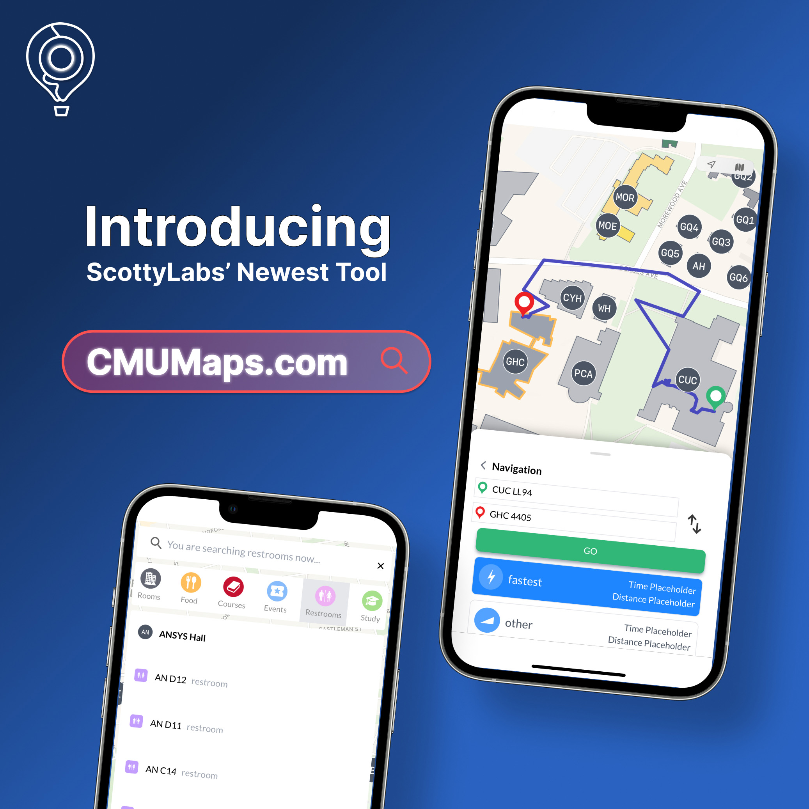
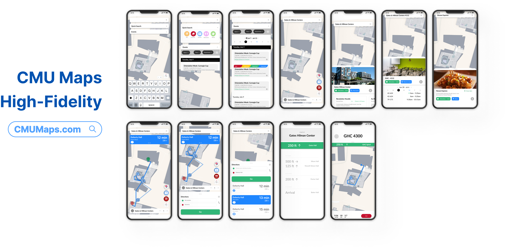
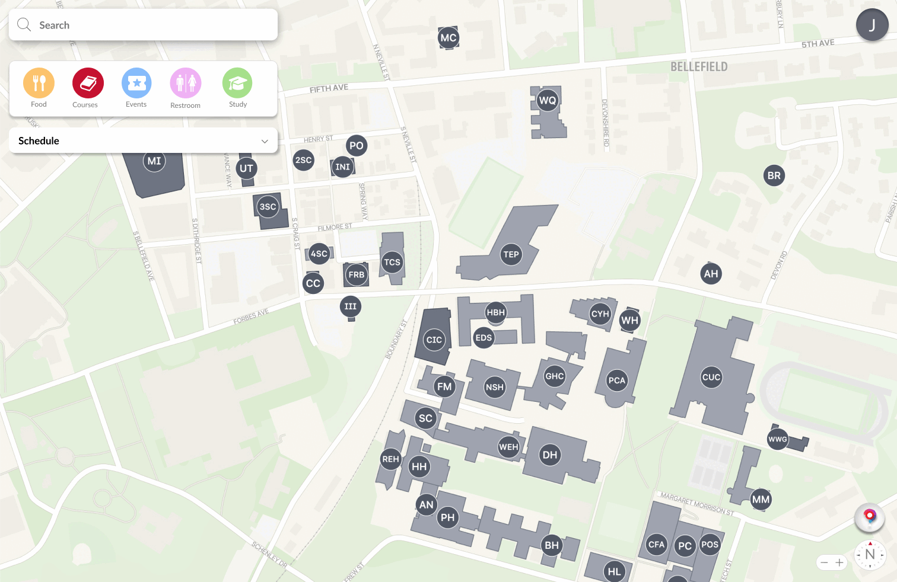

# CMU Maps: Integrated Campus Navigation & Scheduling for Students

## Problem Statement

Navigating the demands of Carnegie Mellon can be overwhelming, with students often feeling the pressure of intense competition and tight schedules. This can lead to burnout and neglect of essential aspects like socializing, proper meals, and time management.

CMU Maps addresses this gap with a responsive React-based application that provides **real-time navigation**, **event listings**, **live room availability**, and **calendar integration**—all accessible through a clean, student-centered interface.

---

## Motivation

At CMU, students often juggle packed schedules across a large campus. The lack of a unified tool leads to wasted time, missed events, and difficulty coordinating meetings.
Through surveys and interviews with students (especially first-years), our team identified common pain points:

* Confusion in locating classes, events, and food options.
* Frustration with outdated room reservation systems.
* Difficulty visualizing schedules alongside campus geography.

CMU Maps was built to **empower students with control over their time and location awareness**, reducing stress and improving daily campus life.

---

## User-Centered Design Relevance

This project embodies **human-centered design** by directly incorporating student feedback into the interface and feature set.
Key benefits:

* **Accessibility**: Options for accessible vs. fastest routes.
* **Efficiency**: Quick access to live room availability and eatery hours.
* **Personalization**: Calendar imports and tailored navigation flows.

---

## Tech Stack

| Layer        | Technology                  | Description                                                             |
| ------------ | --------------------------- | ----------------------------------------------------------------------- |
| **Frontend** | **React + Vite**            | Dynamic SPA with modular UI components                                  |
|              | JavaScript, CSS             | Interaction logic and styling                                           |
| **Design**   | **Figma**                   | Wireframing, high-fidelity prototyping                                  |

---

## Feature Overview

### Navigation

* **Searchable Locations** – Find rooms, buildings, or events instantly.
* **Route Options** – Choose fastest or accessible path, with icon-marked step previews.

### Events & Scheduling

* **Event Dropdown** – Auto-updates with current campus events, filterable by tags.
* **Calendar Import** – Import class schedules from the CMU portal and view them in-app.

### Room Management

* **Live Availability** – View which rooms are booked in real time.
* **One-Click Reservations** – Book directly from the map.

### Building Floor Plans

* Default **contour view** transitions to detailed architectural layouts when zooming in.
* Multi-floor navigation for complex buildings.

---

## Algorithmic / Data Flow Overview

1. **User Search or Selection** → Match query against campus location dataset.
2. **Routing Engine** → Compute fastest or accessible path; generate icon-marked route preview.
3. **Event API & CMU Eats Integration** → Pull live events and dining hours.
4. **Room Reservation Query** → Fetch availability and allow in-app booking.
5. **Map Rendering** → Overlay results on campus map with responsive building floor plans.

---

## Demo & Interface

---

View the full source code below:

